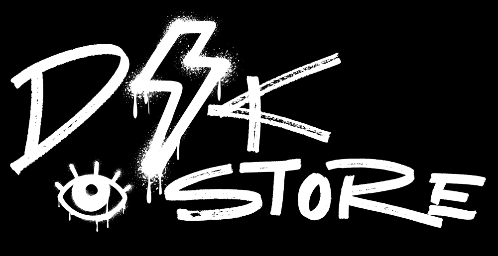

# D4K Store - Next-Gen E-Commerce Platform




**D4K Store** là nền tảng thương mại điện tử hiện đại, mang phong cách **Streetwear / Brutalist Design** độc đáo. Hệ thống được xây dựng với kiến trúc Full-stack mạnh mẽ, tích hợp thanh toán trực tuyến, quản lý đơn hàng theo thời gian thực và các tính năng bảo mật thông minh.

**Live Demo:** [https://www.web-apps.live/](https://www.web-apps.live/)

---

## Tính Năng Nổi Bật (Highlight Features)

### Trải Nghiệm Mua Sắm (Customer Experience)
*   **Giao diện Brutalist Street Style**: Thiết kế độc quyền với hiệu ứng Glitch, tương phản cao, tối ưu cho mobile-first.
*   **Tìm kiếm & Lọc thông minh**: Tìm sản phẩm theo từ khóa, lọc theo danh mục, khoảng giá và thương hiệu với tốc độ phản hồi tức thì.
*   **Giỏ hàng & Checkout**:
    *   Giỏ hàng đồng bộ thời gian thực.
    *   Tích hợp mã giảm giá (Coupon System).
    *   Tính phí vận chuyển tự động.
*   **Thanh toán đa dạng**:
    *   **VNPAY QR**: Tích hợp cổng thanh toán VNPAY chính thức (Support IPN callback & checksum security).
    *   **COD**: Thanh toán khi nhận hàng.

### Hệ Thống Bảo Mật (Security)
*   **Review Spam Protection**:
    *   **Rate Limiting**: Giới hạn tần suất đánh giá để chống spam.
    *   **Content Moderation**: Tự động lọc từ ngữ không phù hợp (Bad word filter).
    *   **Verified Purchase**: Chỉ cho phép đánh giá khi đã mua và nhận hàng thành công.
*   **Authentication**: Hệ thống đăng nhập/đăng ký bảo mật với **Spring Security + JWT (Access Token & Refresh Token)**.
*   **Forgot Password**: Quy trình quên mật khẩu an toàn qua Email OTP.

### Quản Trị Hệ Thống (Admin Dashboard)
Một trang quản trị (Admin Panel) quyền lực dành cho chủ cửa hàng:
*   **Real-time Analytics**:
    *   Biểu đồ doanh thu trực quan (Sales Chart) cập nhật theo thời gian thực (tính theo ngày đặt hàng).
    *   Top sản phẩm bán chạy nhất.
    *   Thống kê tổng quan đơn hàng, người dùng mới.
*   **Quản Lý Sản Phẩm (Product Management)**:
    *   Thêm/Sửa/Xóa sản phẩm với **Multi-image Upload**.
    *   Quản lý biến thể (Size/Color) và tồn kho (Stock) chi tiết.
*   **Quản Lý Đơn Hàng (Order Management)**:
    *   Cập nhật trạng thái đơn (Pending -> Confirmed -> Shipped -> Delivered).
    *   Xử lý hoàn hàng/hủy đơn và tự động hoàn lại tồn kho (Stock Rollback).

---

## Kiến Trúc Hệ Thống (Architecture)

### Backend (Spring Boot 3)
*   **Core**: Spring Boot 3.3, Java 17.
*   **Database**: PostgreSQL 15+, Spring Data JPA.
*   **Security**: Spring Security 6, JWT Filter.
*   **Payment**: VNPAY SDK Integration.
*   **API Documentation**: Swagger UI / OpenAPI.
*   **Storage**: Cloudinary (Image storage).

### Frontend (React 18)
*   **Core**: ReactJS, Vite.
*   **State Management**: Zustand (nhẹ hơn và nhanh hơn Redux).
*   **Routing**: React Router DOM v6.
*   **UI/Styling**: Tailwind CSS, Framer Motion (Animations), Recharts (Biểu đồ).
*   **HTTP Client**: Axios (với Interceptors xử lý Token tự động).

---

## Hướng Dẫn Cài Đặt (Installation)

### Yêu cầu hệ thống
*   Java JDK 17+
*   Node.js 18+
*   PostgreSQL 15+

### 1. Backend Setup
```bash
cd backend
# Cấu hình database trong src/main/resources/application.yml
# Chạy ứng dụng
mvn spring-boot:run
```
*Backend chạy tại: `http://localhost:8080`*

### 2. Frontend Setup
```bash
cd frontend
# Cài đặt thư viện
npm install
# Chạy development server
npm run dev
```
*Frontend chạy tại: `http://localhost:5173`*

---

## Author
**Danku** - *Fullstack Developer*
*   Contact: [Danku2894](https://github.com/Danku2894)

---
*© 2024 D4K Store. All rights reserved.*
