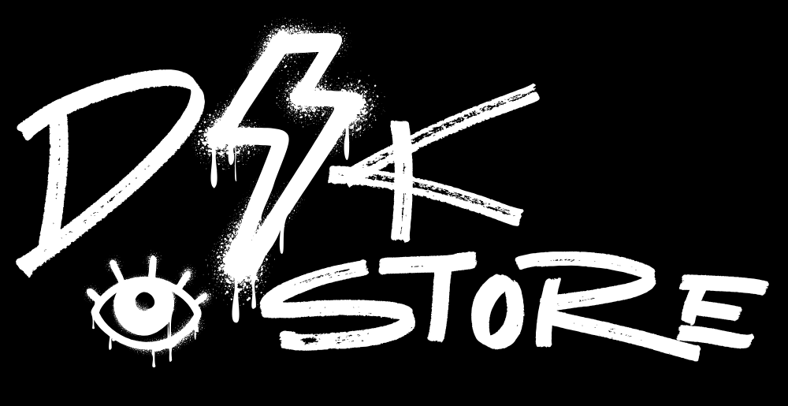

<div align="center">
  

  # D4K Store - Next-Gen E-Commerce Platform

  <p align="center">
    <strong>Nền tảng thương mại điện tử hiện đại, mang phong cách Brutalist/Streetwear Design độc quyền.</strong><br/>
    Được tối ưu hóa hiệu suất, kiến trúc Full-stack mạnh mẽ, bảo mật cao và chất lượng code đạt chuẩn (Clean Code & Unit Tested).
  </p>

  [](https://spring.io/projects/spring-boot)
  [](https://reactjs.org/)
  [](https://www.postgresql.org/)
  [](https://vnpay.vn/)
  [](https://jwt.io/)
  [](#)

  **[Live Demo](https://www.web-apps.live/)** 
</div>

---

## 🌟 Tính Năng Nổi Bật (Highlight Features)

### 🎨 Trải Nghiệm Mua Sắm (Customer Experience)
- **Giao diện Brutalist Street Style**: Thiết kế độc quyền với hiệu ứng Glitch, tương phản cao, tối ưu tuyệt đối cho mobile-first.
- **Tìm kiếm & Lọc thông minh**: Phân tích từ khóa, lọc theo danh mục, khoảng giá và thương hiệu với tốc độ phản hồi tức thì (Real-time Filtering).
- **Giỏ hàng & Checkout Tối Ưu**:
  - Giỏ hàng đồng bộ thời gian thực qua State Management.
  - Tích hợp hệ thống mã giảm giá (Coupon System) thông minh.
  - Tính phí vận chuyển tự động.
- **Thanh toán đa dạng & An toàn**:
  - **VNPAY QR**: Tích hợp cổng thanh toán VNPAY chính thức (Support IPN callback & checksum security, chống gian lận).
  - **COD**: Hỗ trợ thanh toán khi nhận hàng.

### 🛡️ Hệ Thống Bảo Mật & Chất Lượng (Security & Quality)
- **Kiến trúc Code Chuẩn Mực (Clean Code)**: 
  - Giao diện được xử lý triệt để các cảnh báo ESLint, giải quyết hoàn toàn lỗi `exhaustive-deps` trong React Hook, đảm bảo logic render chính xác và không thất thoát bộ nhớ (Memory Leak).
- **Backend Unit Testing Setup**:
  - Tích hợp sẵn môi trường kiểm thử với **JUnit 5** và **Mockito**.
  - Bao phủ kiểm thử (Test Coverage) cho các luồng nghiệp vụ lõi như Authentication, Payment, đảm bảo tính đúng đắn của logic hệ thống trước mọi thay đổi.
- **Review Spam Protection**:
  - **Rate Limiting**: Giới hạn tần suất đánh giá, chống tấn công DDoS và Spam.
  - **Content Moderation**: Tự động lọc từ ngữ không phù hợp (Bad word filter).
  - **Verified Purchase**: Xác thực chặt chẽ, chỉ cho phép đánh giá khi đã hoàn tất nhận hàng.
- **Authentication**: Hệ thống đăng nhập/đăng ký bảo mật với **Spring Security + JWT (Access Token & Refresh Token)**. Quy trình quên mật khẩu an toàn tuyệt đối qua Email OTP.

### 📈 Quản Trị Hệ Thống (Admin Dashboard)
Trang quản trị quyền lực, cung cấp góc nhìn toàn cảnh về tình hình kinh doanh:
- **Real-time Analytics**:
  - Biểu đồ doanh thu trực quan (Sales Chart) cập nhật liên tục.
  - Theo dõi top sản phẩm bán chạy nhất, phân tích hành vi người mua.
  - Thống kê tổng quan đơn hàng, tỷ lệ chuyển đổi và người dùng mới.
- **Quản Lý Sản Phẩm Tiên Tiến (Product Management)**:
  - Thêm/Sửa/Xóa sản phẩm với tính năng **Multi-image Upload** (tích hợp Cloudinary).
  - Quản lý biến thể đa dạng (Size/Color) và theo dõi tồn kho (Stock) chi tiết tới từng SKU.
- **Quản Lý Đơn Hàng Thông Minh (Order Management)**:
  - Workflow cập nhật trạng thái đơn chuẩn xác (Pending -> Confirmed -> Shipped -> Delivered).
  - Tự động xử lý hoàn hàng/hủy đơn và tự động hoàn lại tồn kho (Stock Rollback) logic.

---

## 🏗️ Kiến Trúc Hệ Thống (Architecture)

### Backend (Spring Boot 3)
- **Core Framework**: Spring Boot 3.3, Java 17.
- **Database**: PostgreSQL 15+, Spring Data JPA.
- **Security**: Spring Security 6, JWT Filter, Rate Limiting (Bucket4j).
- **Testing**: JUnit 5, Mockito.
- **Payment Gateway**: VNPAY SDK Integration.
- **API Documentation**: Swagger UI / OpenAPI.
- **Cloud Storage**: Cloudinary (Image storage).

### Frontend (React 18)
- **Core Framework**: ReactJS 18, Vite (Fast build & HMR).
- **State Management**: Zustand (Cấu trúc nhẹ, render nhanh hơn Redux).
- **Routing**: React Router DOM v6.
- **UI/Styling**: Tailwind CSS (Utility-first), Framer Motion (Micro-animations), Recharts (Data Visualization).
- **HTTP Client**: Axios (Tích hợp Interceptors tự động renew token & bắt lỗi global).

---

## 🚀 Hướng Dẫn Cài Đặt (Installation)

### Yêu cầu hệ thống
- Java JDK 17+
- Node.js 18+
- PostgreSQL 15+

### 1. Khởi chạy Backend
```bash
cd backend
# Cấu hình chuỗi kết nối database trong src/main/resources/application.yml

# (Tùy chọn) Chạy kiểm thử Unit Test để đảm bảo logic lõi
mvn test

# Khởi chạy ứng dụng
mvn spring-boot:run
```
*📍 Backend sẽ chạy tại: `http://localhost:8080`*

### 2. Khởi chạy Frontend
```bash
cd frontend
# Cài đặt toàn bộ thư viện
npm install

# Khởi chạy development server
npm run dev
```
*📍 Frontend sẽ chạy tại: `http://localhost:5173`*

---

## 👨‍💻 Author
**Danku** - *Fullstack Developer*
*   GitHub: [Danku2894](https://github.com/Danku2894)

---
<div align="center">
  <i>© 2024 - 2026 D4K Store. All rights reserved. Built with passion and clean code.</i>
</div>
